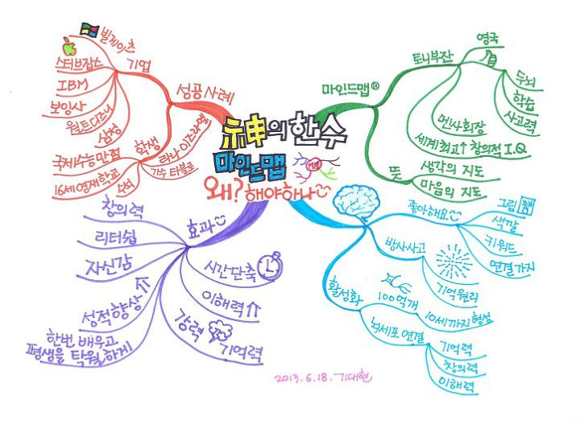

# 마인드맵 왜 해야하나
* 토니부잔
  * 영국
  * 좋음
    * 두뇌
    * 학습
    * 사고력
  * 멘사회장
  * 세계최고 창의적 I.Q.

* 뜻
  * 생각의 지도
  * 마음의 지도

* 뇌
  * 좋아해요
    * 그림
    * 색깔
    * 키워드
    * 연결까지
  * 방사사고
    * 화살표
    * 기억원리
  * 활성화
    * 100억개
      * 10세까지 형성
    * 뇌세포 연결
      * 기억력
      * 창의력
      * 이해력

* 효과
  * 창의력
  * 리더쉽
  * 자신갑
  * 성적향상
  * 한번 배우고 평생을 탁월하게
  * 시간단축
  * 이해력 향상
  * 강력 기억력

* 성공사례
  * 기업
    * 빌게이츠
    * 스티브잡스
    * IBM
    * 보잉
    * 월트 디즈니
    * 삼성
  * 학생
    * 국제 수능 만정
    * 16세 영재 학교
    * 수석
    * 가수 타블로
    * 라나 이즈라엘

