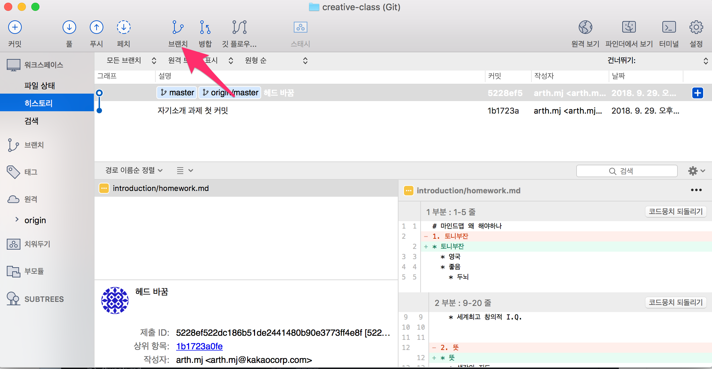
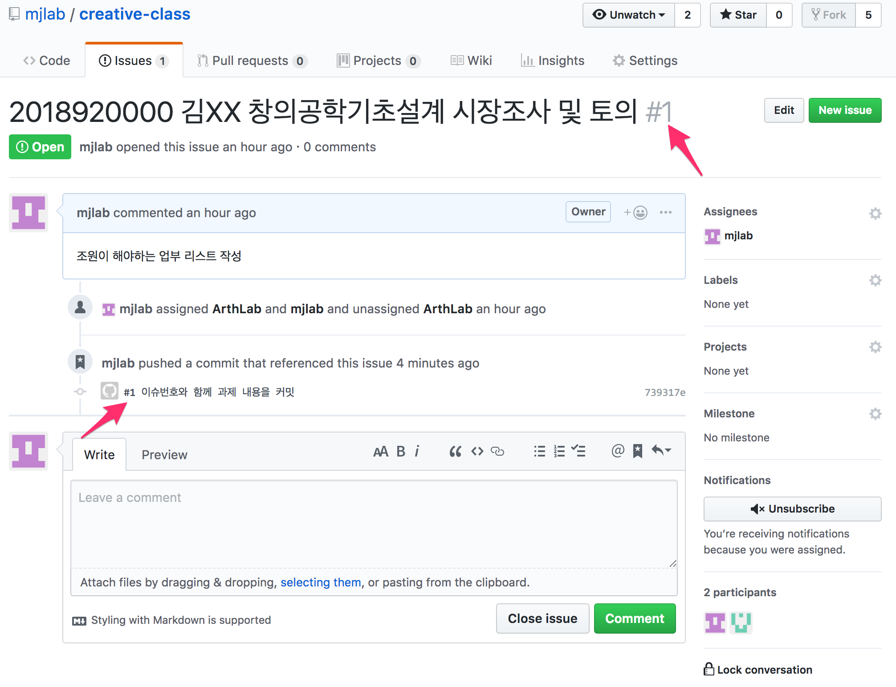
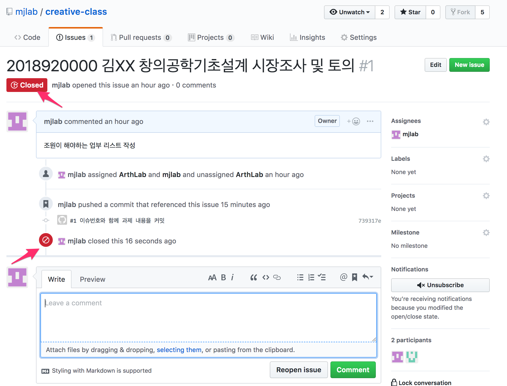

# 저장소에 다른 사람 초대

****


화살표 방향의 Settings 클릭

****

Collaborators 클릭

****

github 사용자 이름이나 이메일을 넣고 Add Collaborator를 클릭

****

성공적으로 추가되면 위와 같은 화면이 보임

****

copy invitation link 를 클릭

아래 화살표 버튼을 누르면 클립보드에 초대 링크가 복사됨

링크를 초대한 조원과 공유

****

조원이 이 링크로 들어면 다음과 같은 페이지를 볼 수 있음

Accept invitation을 클릭하면 저장소에 초대완료

-----------------------------------
# issue 만들기

****


화살표 방향의 issue tab을 클릭

****


New issue 버튼을 클릭

****

이슈 이름에는 본인의 이름과 학번을 넣고
코멘트에는 본인이 해야할 일을 넣음

오른쪽에 Assignees를 누르면 이 issue를 지정할 사람들이 나오는데 본인의 이름을 찾거나 assign your self를 누르면 본인에게 assign 됨

모든 정보를 채웠으면 Submit new issue 버튼을 누름

****

issue가 생성되면 위와 같은 화면이 나오고 화살표 끝에 issue 번호를 확인 할 수 있다.

-----------------------------------
# 브랜치

## 브랜치 생성하기

여기서는 sourcetree 기준으로 설명 (다른 git client를 써도 무방)

****

브랜치 버튼을 누름

****

브랜치 이름을 정한후 브랜치 생성을 누른다.

이때, 브랜치 시작 시점을 정할 수 있는데 작업 사본 부모는 위에 있는 master 브랜치에서 시작하는 것을 의미
명시된 커밋은 특정 커밋 시점에서 시작하는데 고르기를 버튼을 눌러 시작하고 싶은 커밋을 선택하거나 커밋 hash를 찾아 입력하면 된다.

****

커밋 태그에 브랜치가 생긴것을 볼 수 있다.

여기 까지는 로컬(본인 컴퓨터)에만 생긴 것이고 github에 push 해야 다른 팀원들이 볼 수 있다.

****

왼쪽에 브랜치 탭을 눌러 보면 현재 선택 된 프랜치가 볼드체로 되어 있는 것을 볼 수 있다. 더블 클릭시 브랜치를 바꿀 수 있음

****

화살표의 푸시를 누르고 푸시할 브랜치를 체크후 확인을 누르면 github에 브랜치가 푸시된다

****
위의 과정을 간단히 명령어로 나타낸다면
(현재 master branch로 가정)

```
git branch 2018920000_subject_1
git checkout 2018920000_subject_1
git push origin 2018920000_subject_1
```

---------------
# issue 번호와 함께 커밋하기

****

화살표 부분처럼 위에서 만든 이슈번호를 커밋 메세지 앞에 삽입한다.
커밋 & 푸시를 하고 나면 issue 탭에서 다음과 같이 커밋메세지를 볼 수 있다.

****

화살표 끝의 번호를 따라 메세지가 남게 되고,
특정 이슈를 트래킹하기 편하게 된다.

`토의가 필요한 내용이나 의견이 있는 경우 위의 이슈탭에 적극적으로 코멘트를 남기도록 한다`

****


코드 히스토리에서도 issue 번호로 찾아 갈 수 있다.

---------------
# issue 종료하기

****

Close issue 버튼을 누르게 되면 해당 이슈는 종료 됨

****

해당 이슈는 close 표시로 바뀐다.

****
필요시 Reopen issue를 눌러 다시 이슈를 열 수 있다.


****
키워드로 issue 종료


다음의 키워드들은 issue 종료로 인식한다.
```
close, closes, closed, fix, fixes, fixed, resolve, resolves, resolved
```


하지만 실제로는 issue가 닫히지 않는데 default branch(여기서는 master)에 병합(merge)되는 경우 issue가 닫히게 된다.

---------------
# 브랜치 병합(merge)하기
master와 2018920000_subject_1 브랜치와 합병을 하려고 한다.

****

master 브랜치로 브랜치를 변경한다.

병합버튼을 클릭한다.

****

20189200002018920000_subject_1의 최신 커밋을 클릭한다.

그 후 확인 버튼을 누른다.

****

확인 버튼을 누르고 나면 위의 화면을 볼 수 있다.

****

푸시 버튼을 눌러 일반적인 푸시와 동일하게 진행한다.

****

푸시후에 master head가 최신으로 갱신된걸 볼 수 있다.

****

더불어 아까 fixed로 커밋한 issue가 닫힌걸 볼 수 있다.

```
브랜치 병합시 conflict 가 생길 수 있는데 이 때는
stash의 개념을 찾아보자
```

병합의 과정을 명령어로 나타내보면 (2018920000_subject_1 브랜치에서)

```
git checkout master
git merge 2018920000_subject_1
```
